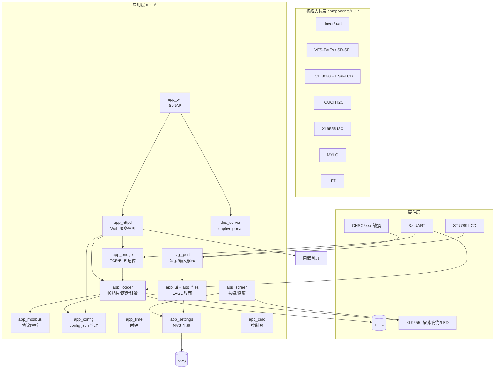
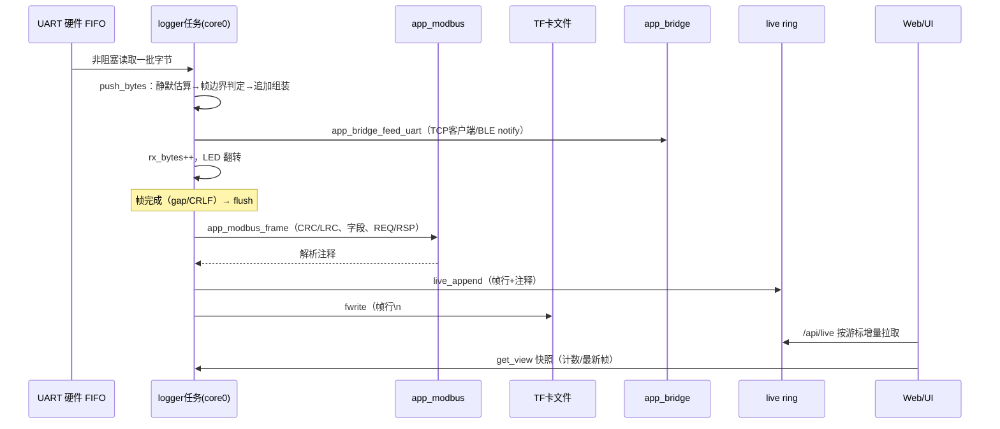
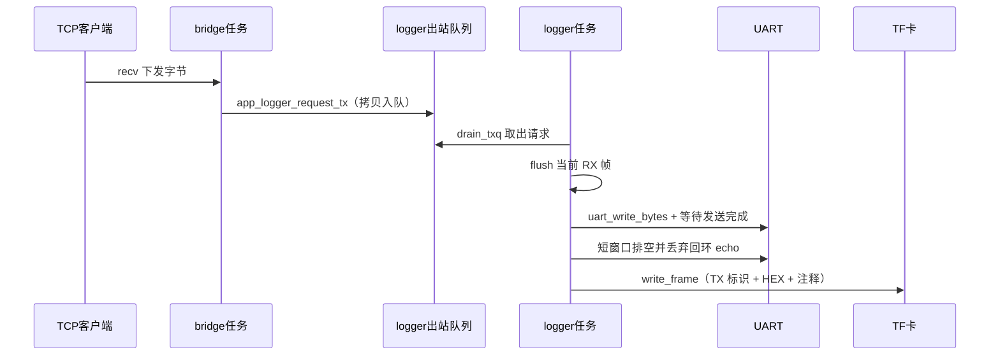
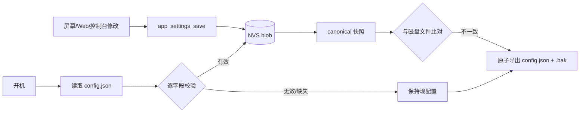
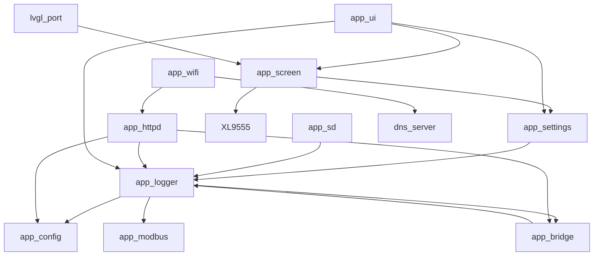

# ESP32-S3 多串口记录仪 — 项目代码结构分析报告

> 版本：对应 main 分支提交 `8dc74c2`（2026-10）
> 文档目的：系统阐述项目整体架构、模块职责、核心算法、数据流转与依赖关系，作为团队理解系统与后续维护的基线文档。

***

## 目录

1. [项目概述](#1-项目概述)
2. [硬件平台与引脚映射](#2-硬件平台与引脚映射)
3. [整体架构](#3-整体架构)
4. [目录与模块划分](#4-目录与模块划分)
5. [功能模块详细解析](#5-功能模块详细解析)
6. [关键数据结构与接口关系](#6-关键数据结构与接口关系)
7. [数据流转机制](#7-数据流转机制)
8. [模块依赖与交互关系](#8-模块依赖与交互关系)
9. [并发模型与同步机制](#9-并发模型与同步机制)
10. [潜在问题与优化建议](#10-潜在问题与优化建议)
11. [附录：构建与运行](#11-附录构建与运行)

***

## 1. 项目概述

### 1.1 产品定位

本项目是一台面向工业现场的 **多串口通信数据记录仪**，基于正点原子 ESP32-S3 BOX 开发板，核心能力：

- **三路串口同时采集**：将通信字节流按「报文帧」实时记录到 TF 卡，毫秒级时间戳 + 收发方向标识；
- **Modbus 协议解析**：自动识别 RTU/ASCII，校验 CRC/LRC，输出结构化字段注释；
- **Web 管理界面**：通过 WiFi 热点提供参数配置、实时数据流、文件浏览/下载、配置备份；
- **透传通道**：TCP 端口与 BLE 双向透传；
- **屏幕交互**：LVGL 六标签页 GUI，物理按键控制屏幕开关与自动息屏。

### 1.2 技术栈

| 层面    | 选型                                            |
| ----- | --------------------------------------------- |
| 框架    | ESP-IDF v5.3.1（C 语言，FreeRTOS SMP）             |
| GUI   | LVGL 8.x（managed component，自定义中文点阵字体）         |
| 文件系统  | FAT（VFS-FatFs），SPI 模式 SD 卡，支持 exFAT/长文件名      |
| 配置持久化 | NVS（Blob + 简单键值）                              |
| Web   | esp\_http\_server + 内嵌单页应用（HTML/CSS/JS 编译进固件） |
| 协议解析  | cJSON（ESP-IDF json 组件）；自研 Modbus 解析           |
| 蓝牙    | NimBLE（GATT 自定义服务）                            |
| 内存策略  | 大缓冲全部置于 8MB 八线 PSRAM                          |

***

## 2. 硬件平台与引脚映射

### 2.1 核心资源

- **MCU**：ESP32-S3，双核 Xtensa LX7 @240MHz，512KB 片内 SRAM；
- **PSRAM**：8MB 八线 PSRAM（AP 颗粒，80MHz，启动时识别）；
- **显示**：ST7789，320×240，**Intel 8080 8 位并行总线**（ESP-LCD `i80` 驱动，DMA 刷帧）；
- **触摸**：CHSC5xxx 电容触摸（I2C）；
- **扩展 IO**：**XL9555**（I2C 地址 0x20），16 位 GPIO 扩展，承载按键、背光、蜂鸣器、指示灯等；
- **存储卡**：TF 卡，SPI 模式，挂载点 `/sdcard`。

### 2.2 引脚/总线映射表

| 资源             | 引脚 / 通道                     | 说明                     |
| -------------- | --------------------------- | ---------------------- |
| I2C 总线 0       | SDA=48，SCL=45，400kHz        | XL9555、CHSC5xxx **共用** |
| UART0          | TX=43，RX=44                 | 板载口                    |
| UART1          | TX=5，RX=6                   | J2                     |
| UART2          | TX=8，RX=18                  | J3                     |
| SD-SPI         | MOSI=16，MISO=15，CLK=7，CS=17 | 最高 20MHz               |
| 板载 LED         | GPIO4                       | 低电平点亮                  |
| XL9555 K1      | P04（`KEY0_IO 0x0010`）       | 输入，低有效                 |
| XL9555 K2      | P03（`KEY1_IO 0x0008`）       | 输入，低有效                 |
| XL9555 背光      | P07（`LCD_BL_IO 0x0080`）     | 输出                     |
| XL9555 红灯 LEDR | P08（`LEDR_IO 0x0100`）       | 状态反馈                   |
| XL9555 触摸复位    | P06（`CTP_RST_IO`）           | 上电时序控制                 |

***

## 3. 整体架构

### 3.1 分层架构图



### 3.2 架构特点

1. **数据流与显示流物理隔离**：串口采集/落盘在 core0 实时任务，屏幕渲染在 core1，二者仅通过「快照结构 + 互斥锁」弱耦合。这保证了 UI 卡顿绝不影响数据完整性。
2. **单一数据真相源**：运行配置以 NVS 为权威，config.json 是可编辑/可迁移的外部镜像，由「快照比对」机制自动收敛。
3. **大缓冲全 PSRAM 化**：帧缓冲、配置缓冲、cJSON 节点均在 PSRAM，为 BLE/WiFi/httpd 共存保留内部内存。
4. **启动顺序强约束**：NVS/时间 → SD → 配置加载 → logger → UI → BLE → 控制台/屏幕 → WiFi → httpd → TCP，顺序错误曾导致队列空指针和 WiFi 内存失败（见第 10 节）。

***

## 4. 目录与模块划分

```text
esp32_uart_log/
├── CMakeLists.txt                # 顶层工程：project(uart_logger)
├── partitions.csv                # 分区表（app 4MB）
├── sdkconfig / sdkconfig.defaults
├── components/
│   └── BSP/                      # 板级支持包（厂商代码 + 改造）
│       ├── LCD/                  # ST7789 + 8080 总线初始化与绘制
│       ├── TOUCH/                # CHSC5xxx I2C 触摸驱动
│       ├── XL9555/               # I2C 16 位扩展 IO（按键/背光/LED）
│       ├── MYIIC/                # I2C 主驱动封装（命令链接/传输）
│       └── LED/                  # 板载 LED
├── managed_components/lvgl__lvgl # LVGL 8.x（IDF 自动管理）
└── main/
    ├── main.c                    # 启动编排（初始化顺序总控）
    ├── board.h                   # 三路 UART 引脚定义（APP_PORT_COUNT=3）
    ├── app_settings.[ch]         # 全局配置 + NVS blob（版本化）
    ├── app_time.[ch]             # RTC 时间、校时、掉电保持
    ├── app_sd.[ch]               # SD-SPI 挂载、容量、文件系统锁
    ├── app_logger.[ch]           # 核心：帧组装、出站队列、统计、live ring
    ├── app_modbus.[ch]           # Modbus RTU/ASCII 解析
    ├── app_config.[ch]           # config.json 序列化/校验/原子替换
    ├── app_screen.[ch]           # 按键状态机、屏幕开关、自动息屏
    ├── app_bridge.[ch]           # TCP 透传 + BLE GATT
    ├── app_wifi.[ch]             # SoftAP 管理
    ├── app_httpd.[ch]            # HTTP 服务器 + REST API + 内嵌网页
    ├── dns_server.[ch]           # DNS 重定向（captive portal）
    ├── app_ui.[ch]               # LVGL 六标签页界面
    ├── app_files.[ch]            # 屏幕端文件浏览器
    ├── lvgl_port.[ch]            # LVGL 显示/输入/时基移植
    ├── app_cmd.[ch]              # USB 控制台命令
    ├── font_cn_16.[ch]           # 自定义 16px 中文点阵
    └── web_index.html            # Web 单页应用源文件（编译进 app_httpd）
```

模块按职责可归为四组：

| 分组        | 模块                                                 | 职责                       |
| --------- | -------------------------------------------------- | ------------------------ |
| **核心数据面** | app\_logger、app\_modbus                            | 串口字节流 → 帧 → 落盘/分发，协议解析   |
| **配置面**   | app\_settings、app\_config、app\_time                | NVS 配置、config.json 镜像、时钟 |
| **连接面**   | app\_wifi、app\_httpd、app\_bridge、dns\_server       | 热点、Web、TCP/BLE 透传        |
| **交互面**   | app\_ui、app\_files、app\_screen、lvgl\_port、app\_cmd | GUI、按键息屏、控制台             |
| **驱动面**   | app\_sd、components/BSP/\*                          | 硬件抽象                     |

***

## 5. 功能模块详细解析

### 5.1 app\_logger — 系统核心

系统中最关键的模块，运行在独立的 **logger 任务（core0，栈 8192，优先级 8）**。

**职责：**

1. 轮询读取三路 UART，把字节流按帧组装；
2. 帧完成后格式化（时间戳 + 方向标识 + HEX）、调用 Modbus 解析追加注释；
3. 写入 TF 卡文件（按分段时长滚动）；
4. 维护 64 位收发统计；
5. 维护 live ring（供 Web `/api/live` 增量轮询）；
6. 处理出站请求队列（TX）；
7. 触发通信 LED 指示。

**核心算法 — 帧边界判定（报文完整性的关键）：**

- 帧缓冲 `FRAME_BYTES = 520`（覆盖 RTU 最大 256B 与 ASCII「`:` + 512 字符 + CRLF」）；
- 二进制（RTU）帧间隙按 Modbus 规范：
  ```text
  gap = 11 bit × 3.5 / baud        （高波特率下限固定 1.75ms）
  例：19200 baud → 约 2.0ms；115200 baud → 1.75ms
  ```
- ASCII 帧以 `:` 起始、CRLF 结束界定，不受静默时长影响；
- **静默时间估算**（解决轮询架构无法逐字节打时间戳的问题）：
  ```text
  silence = max(0, 轮询窗口时长 − 本批字节数 × 单字节线时长)
  连续流传输时数据时长填满窗口 → silence≈0 → 帧不被切断；
  真实帧间间隙 → 空读累积 → silence≥gap → 切帧。
  ```
- **自适应轮询**：有数据或帧组装中时 1ms 周期（保证时序精度），全端口空闲时降到 8ms（节能）。

**文件滚动：** 文件按 `segment_min` 配置切段，以段起始时间命名 `YYYYmmdd_HHMMSS.txt`，通过一天内秒数对齐段边界；每个新文件写三行头部说明（端口引脚、段时间、格式约定）。

### 5.2 app\_modbus — 协议解析

**纯无状态 + 每端口配对状态** 的解析模块，可在 PC 端独立编译测试（已用 14 个用例验证）。

**核心算法：**

1. **RTU/ASCII 自动识别**：首字节为 `:` 即 ASCII，否则按 RTU；
2. **CRC16**（RTU）：多项式 `0xA001`（0x8005 的反射形式），逐字节移位计算，**线序低字节先传**（`recv = buf[len-2] | buf[len-1]<<8`）；
3. **LRC**（ASCII）：对解码字节求和取负；
4. **PDU 结构解析**：按功能码分支提取字段：
   | 功能码   | 含义       | 提取字段             |
   | ----- | -------- | ---------------- |
   | 01/02 | 读线圈/离散量  | 起始地址、数量          |
   | 03/04 | 读寄存器     | 起始地址、数量 / 应答字节数  |
   | 05/06 | 单线圈/单寄存器 | 地址、数值            |
   | 0F/10 | 批量写      | 起始地址、数量、字节数 / 应答 |
   | 16/17 | 屏蔽写/读报文  | 掩码等              |
   | 最高位置位 | 异常响应     | 异常码              |
5. **REQ/RSP 配对状态机**：对 05/06 等请求与应答「同形态」的帧，以每端口「addr+fc 待应答」标志消歧——首次为 REQ，待应答期内再次出现同帧即 RSP；无法判定时只标 `RX`，不臆测。

**输出：** 在报文行之后追加一行全 ASCII 注释，例如：

```text
# MB-RTU REQ addr=1 fc=3 READ_HOLD start=0 qty=10 check=OK
```

非 Modbus 帧保持原始 HEX，不追加注释。

### 5.3 app\_settings — 配置模型与 NVS

- 定义全局配置结构 `app_settings_t`（分段时长、息屏开关、三串口参数）；
- 以 **版本化 Blob** 存于 NVS 命名空间 `logger`，键 `cfg`，魔数 `LOG1`；
- **版本兼容策略**：当前 blob v3；读取同时接受 v2（旧长度 32B，新增 `screen_auto_off` 取默认 true）与 v3，升级不丢配置；
- `app_settings_save` 内含取值范围兜底校验（分段 1\~1440 分钟等）。

### 5.4 app\_config — config.json 镜像管理

- 通过 **cJSON 内存钩子**让所有 cJSON 节点/字符串分配在 PSRAM，避免内部堆碎片；
- `app_config_build_snapshot`：从 settings + wifi + bridge 构建一行 canonical（固定键序）JSON；
- **自动双向同步**：logger 每 2 秒调用 `app_config_needs_export`——将快照与磁盘文件**逐字符比对**，文件缺失或任何不一致（运行期修改、字段落后、外部改坏）即自动导出；屏幕/Web/控制台任何来源的修改最终都落到同一 NVS 状态，因此天然「来源无关」；
- **原子替换流程**（兼顾 FatFs 语义）：
  ```text
  写 .cfg.tmp → 流式备份 config.json.bak → remove(config.json) → rename(tmp→config.json)
  ```
  FatFs 的 rename 在目标已存在时失败（不同于 POSIX），故必须先 remove；
- `app_config_import_text`：上传/启动加载共用，逐字段校验，非法整体拒绝。

### 5.5 app\_screen — 按键与息屏管理

独立 **screen 任务（栈 4096，优先级 5，20ms 周期）**。

**按键状态机：**

- 每周期一次 I2C 事务（`xl9555_read_byte`）同时读取 K1/K2；
- **消抖**：电平连续稳定 ≥40ms 才确认按下/松开（I2C 偶发错误返回全 1 会被消抖过滤）；
- **长按**：确认按下后持续达 **2000ms** 触发一次屏幕动作（K1→息屏 / K2→点亮），仅状态变化时执行，标记 `long_consumed`；
- **短按**：松开时未消费长按 → 写 `volatile` 标志；UI 任务的 50ms lv\_timer 在 LVGL 上下文读取并切换标签（规避跨线程操作 LVGL）；
- **自动息屏**：屏幕点亮且 `screen_auto_off` 时，距上次活动 >300s 自动息屏；唤醒后活动计时重置；
- **反馈**：每次切换写背光 + LEDR 快闪 3 次 + 日志。

### 5.6 app\_bridge — TCP/BLE 透传

- **TCP 透传**：每路端口监听 `8081+i`，**bridge 任务（栈 4096，优先级 6）** 轮询 accept/recv；下发数据不直接写串口，而是调用 `app_logger_request_tx` 进入 logger 出站队列（TX 记录与实际发送统一由 logger 完成）；
- **BLE（NimBLE GATT）**：自定义服务，MTU 128，写入回调同样转发 logger 出站队列；上行数据由 logger 在每批 RX 时调用 `app_bridge_feed_uart` 分发给 TCP 客户端与 BLE notify；
- 配置 blob 独立存 NVS 命名空间 `bridge`（魔数 0x42524432）；`app_bridge_persist` 提供「只写 NVS 不运行期生效」的持久化入口（供配置导入）。

### 5.7 app\_wifi / dns\_server

- app\_wifi：SoftAP（默认 SSID `UART-LOG`），默认信道 6，`esp_wifi_set_storage(RAM)`；`app_wifi_persist` 提供 NVS 持久化入口；WiFi 名称/密码运行期导入后于下次启动生效；
- dns\_server：UDP 53，解析所有 A 记录查询并以 AP IP 应答，支撑手机/电脑 captive portal 自动弹出配置页。

### 5.8 app\_httpd — Web 服务器与 REST API

esp\_http\_server，约 13 个处理器。`WEB_PAGE` 为编译期 C 字符串（由 `web_index.html` 经 Node 脚本转义同步）。

| 方法   | 路径                                                | 功能             |
| ---- | ------------------------------------------------- | -------------- |
| GET  | `/`                                               | 内嵌单页应用         |
| GET  | `/api/status`                                     | 时间、SD、三端口状态与计数 |
| GET  | `/api/files?path=`                                | 目录列举           |
| GET  | `/dl?path=`                                       | 文件下载           |
| GET  | `/api/port`                                       | 设置串口参数（即时生效）   |
| GET  | `/api/live?i=&<cursor>`                           | 实时数据流增量拉取      |
| GET  | `/api/bridge` `/api/bridge_tcp` `/api/bridge_ble` | 透传状态与开关        |
| GET  | `/api/config?op=`                                 | 导出/重载/恢复       |
| POST | `/api/config_upload`                              | 上传 config.json |
| 任意   | `/api/zip`                                        | 多文件 ZIP 打包下载   |

### 5.9 交互面：app\_ui / app\_files / lvgl\_port / app\_cmd

- **app\_ui**：六个标签页（状态/串口/时钟/日志/文件/WIFI）；状态以 `refresh_cb`（400ms lv\_timer）轮询快照刷新；内置自建 btnmatrix 键盘供文本输入；
- **app\_files**：屏幕端文件浏览（分页、大小、打开查看），查看时通知 logger 释放文件句柄避免共享冲突；
- **lvgl\_port**：LVGL 移植——双 PSRAM 绘制缓冲（各 16 行像素）、ST7789 flush 回调、触摸输入读取（按下时 `app_screen_note_activity`）、1ms 时基定时器；
- **app\_cmd**：USB 串口控制台（status/open/baud/time/seg/inject/tx/cfg 等），调试与无屏化基础。

***

## 6. 关键数据结构与接口关系

### 6.1 配置结构（app\_settings.h）

```c
typedef struct {
    uint32_t baud;
    uart_word_length_t data_bits;
    uart_stop_bits_t stop_bits;
    uart_parity_t parity;
    bool enabled;
} port_setting_t;

typedef struct {
    uint16_t segment_min;   // 日志分段时长（分钟）
    bool screen_auto_off;   // 自动息屏开关（默认 true）
    port_setting_t port[APP_PORT_COUNT];
} app_settings_t;
```

### 6.2 视图快照（app\_logger.h，UI/API 只读消费）

```c
typedef struct {
    bool sd_mounted;
    uint32_t sd_total_mb, sd_free_mb;
    char sd_msg[48];
    char last_hex[72];      // 最近一帧 HEX
    int  last_port;
    struct {
        bool open; int error;
        uint64_t rx_bytes, drop_lines, tx_frames, tx_bytes; // 64 位统计
        bool sending;
        char param[24], file_name[24];
    } port[APP_PORT_COUNT];
} app_view_t;
```

### 6.3 出站请求（生产者 → logger）

```c
typedef struct { bool used; int port; uint8_t data[520]; int len; } tx_req_t;
bool app_logger_request_tx(int port, const uint8_t *data, int len);
```

### 6.4 模块间主要接口契约

```text
app_logger ──→ app_settings_get        （读取运行参数）
app_logger ──→ app_modbus_frame        （帧解析 + 注释）
app_logger ──→ app_config_needs_export / app_config_export（收敛配置文件）
app_logger ──→ app_bridge_feed_uart    （上行数据分发）
app_bridge ──→ app_logger_request_tx   （下行数据入队）
app_httpd  ──→ app_logger_get_view     （快照读，加锁）
app_httpd  ──→ app_config_*            （配置操作）
app_ui     ──→ app_logger_get_view / app_settings_save
app_screen ──→ app_settings_get        （息屏开关）
lvgl_port  ──→ app_screen_note_activity
```

***

## 7. 数据流转机制

### 7.1 上行（RX）数据流



### 7.2 下行（TX）数据流（以 TCP 客户端为例）



### 7.3 配置数据流



***

## 8. 模块依赖与交互关系

### 8.1 编译期依赖（CMake REQUIRES，main 组件）

```text
main → BSP, nvs_flash, fatfs, sdmmc, esp_timer, driver, console,
        esp_wifi, esp_event, esp_netif, esp_http_server, bt, json
```

`components/BSP` 内部模块（LCD/TOUCH/XL9555 等）通过 ESP-IDF 组件机制互相可见。

### 8.2 运行期依赖关系图



依赖方向总体「上层服务 → 核心数据面 → 驱动」，无环。app\_logger 处于中心位置：它是其他模块的**统计与帧数据提供者**，也是**所有 TX 的唯一执行者**，这种中心化设计简化了并发正确性，但也使其成为系统最关键的单点（见第 10 节）。

***

## 9. 并发模型与同步机制

### 9.1 任务清单

| 任务           | Core  | 栈     | 优先级 | 周期/触发            | 所属模块              |
| ------------ | ----- | ----- | --- | ---------------- | ----------------- |
| logger       | 0（绑定） | 8192  | 8   | 1ms（有流量）/8ms（空闲） | app\_logger       |
| ui           | 1（绑定） | 16384 | 4   | 10ms 循环          | main.c            |
| bridge       | —     | 4096  | 6   | 20ms             | app\_bridge       |
| screen       | —     | 4096  | 5   | 20ms             | app\_screen       |
| dns\_server  | —     | 4096  | 5   | UDP 阻塞           | dns\_server       |
| httpd 内置     | —     | 系统分配  | 系统  | 连接驱动             | esp\_http\_server |
| wifi/bt 系统任务 | —     | 系统分配  | 系统  | 事件               | IDF               |

### 9.2 同步原语

| 原语                     | 位置                  | 保护对象                      |
| ---------------------- | ------------------- | ------------------------- |
| Mutex `s_lock`         | app\_logger         | s\_view、出站队列、请求标志         |
| Mutex `s_lock`         | app\_settings       | s\_cfg                    |
| Mutex `s_lock`         | app\_bridge         | s\_info                   |
| **递归** Mutex `fs_lock` | app\_sd             | 文件系统跨模块互斥（文件浏览/日志写入/配置导出） |
| Mutex `s_lock`         | app\_sd             | 容量信息                      |
| volatile 标志            | app\_ui/app\_screen | 短按跨线程交接                   |

设计约定（见 AGENTS.md）：跨任务硬件操作统一在持有者上下文执行；httpd 线程内不做重初始化；标志位 + 异步处理替代跨线程 UI 调用。

***

## 10. 潜在问题与优化建议

### 10.1 已识别问题

1. **高速流量下状态页显示延迟**（用户已反馈）：根因是三层叠加——
   - 通信 LED「每批翻转」在 1ms 轮询时产生约 2000 笔/秒 I2C 事务，**挤占 XL9555/触摸共用的 I2C 总线**，触摸读取（`portMAX_DELAY`）阻塞 UI 任务；
   - refresh\_cb 每 400ms 无条件更新约 15 个 label（含非可见标签页），状态页近乎全屏重绘；
   - UI 与 logger 的锁争用带来零星抖动。
2. **logger 单点关键**：帧组装、文件写入、TX 执行集中在一个任务，任一慢操作（如 SD 写延迟）都可能影响实时节奏。
3. **运行期计数不持久化**：重启后统计归零（当前设计如此，需确认是否符合长期报表需求）。
4. **时间可靠性依赖 RTC\_NOINIT 魔数**：断电后 RTC 停走，需重新校时；现场若长期断电，时间戳可信度需人工确认。

### 10.2 优化建议（按收益/成本排序）

| 优先级 | 建议                                           | 预期收益                      |
| --- | -------------------------------------------- | ------------------------- |
| 高   | **LED 翻转节流**：改为每 100\~200ms 最多一次或通信状态指示      | 直接释放 I2C 总线，缓解 UI 卡顿，改动最小 |
| 高   | **状态页按需/分区刷新**：仅当前标签可见时更新；计数行 1s、时钟行保持高频     | 减少无效重绘，降低单帧耗时             |
| 中   | **局部重绘/固定 label 宽度**：避免整行重排，只刷计数字段小区域        | 减小刷帧数据量                   |
| 中   | **live/最新帧事件驱动**：替代 400ms 定时轮询               | 提升实时性、降低常态开销              |
| 中   | **关键慢操作解耦**：SD 大块写采用独立缓冲/预分配，降低对 1ms 轮询节奏的干扰 | 提升实时确定性                   |
| 低   | 计数器可选持久化（定期写 NVS）、统计快照高位水位                   | 支撑长期通信量报表                 |
| 低   | 引入看门狗喂狗点与任务耗时埋点（refresh/flush 实际耗时）          | 便于现场量化诊断                  |

### 10.3 架构层面长期建议

- 无屏版本可直接复用配置/数据面（已具备控制台与 config.json 基础）；
- 新功能继续遵循「数据面与交互面隔离、大缓冲进 PSRAM、配置版本化、快照自动收敛」四条既定约束；
- 新增需求通过 OpenSpec 增量修改主 spec（当前 5 个能力、21 条需求），保持文档与实现同步。

***

## 11. 附录：构建与运行

```bash
# 编译（PowerShell）
./build_ascii.bat

# 烧录（build 目录下）
python -m esptool --chip esp32s3 -p COM3 -b 460800 \
  --before default_reset --after hard_reset write_flash \
  --flash_mode dio --flash_size 16MB --flash_freq 80m \
  0x0 bootloader/bootloader.bin \
  0x8000 partition_table/partition-table.bin \
  0x10000 uart_logger.bin

# Web：连接热点 UART-LOG（密码 12345678）→ 访问 http://192.168.4.1
```

默认引脚与现场注意事项（共地、3.3V TTL、高波特率间隙等）详见 `AGENTS.md` 与各文件头注释。

***

> 本报告基于当前源码逐一核对生成，如后续架构调整，请同步更新对应章节并通过 OpenSpec 记录需求变更。

